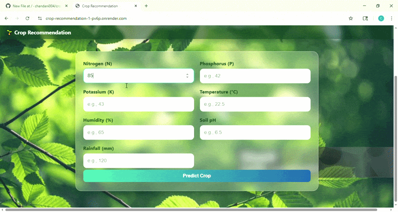

# 🌱 Crop Recommendation System

A Machine Learning based web application that recommends the most suitable crop based on soil and environmental conditions.

---

## 🚀 Live Website

👉 [Click here to use the website](https://crop-recommendation-1-pv6p.onrender.com)

---

## 🎥 Working Demo



---

## 📌 Features

- Predicts best crop using:
  - Nitrogen (N)
  - Phosphorus (P)
  - Potassium (K)
  - Temperature
  - Humidity
  - pH
  - Rainfall
- Clean and user-friendly UI
- Real-time prediction

---

## 🧠 Tech Stack

- **Frontend:** HTML, CSS  
- **Backend:** Python (Flask)  
- **Machine Learning:** Scikit-learn  
- **Deployment:** Render  

---

## 📷 Screenshot

.png)

---

## ⚙️ How to Run Locally

```bash
git clone https://github.com/chandani004/crop-recommendation.git
cd crop-recommendation
pip install -r requirements.txt
python app.py
